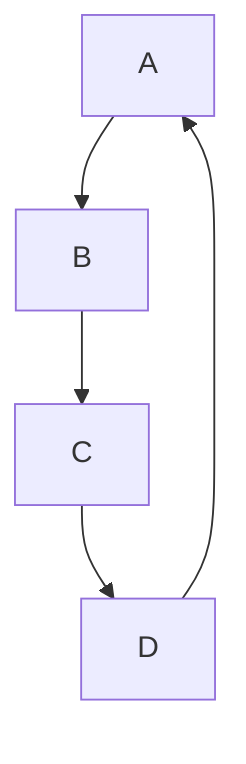
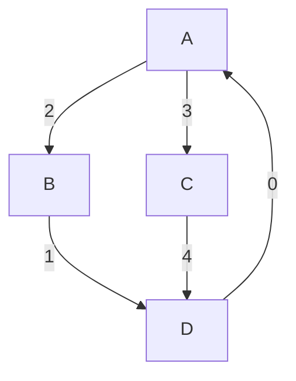

# Graphs

## 1. Terminology

`cycle`: When you start at Node(x), follow the links, and end back at Node(x). It usually have more than 2 nodes to circle back to the start.
`acyclic`: A graph that contains no cycles.
`connected`: When every node has a path to another node
`directed`: When there is a direction to the connections. Think Twitter.
`undirected`: !directed. Facebook has undirected graph to represent data.
`weighted`: The edges have a weight associated with them. Think Maps
`DAG`: Directed, acyclic graph.

Implementation Terms
`vertex`: a point or node on the graph
`edge`: the connection betxit two nodes

`BigO` is commonly stated in terms of V and E where V stands for vertices and E stands for edges. `O(V \* E)` means that we will check every vertex, and on every vertex we check every edge

## 2. Graph Examples

- (1) Cyclic graph

A cyclic graph is a graph that contains at least one cycle. The below is an example of a cyclic directed graph (digraph).



- Cyclic directed graph (digraph): `A → B → C → A`
- Cyclic undirected graph: `A — B — C — A`

- (2) Directed Acyclic Graph (DAG)

No path is leading back to A. So, this is acyclic.


## 3. Graph Representation

There are two ways to represent graph: (1) adjacency list & (2) adjacency matrix.

An `adjacency list` represents a graph as a list of vertices, where each vertex points to a list of adjacent vertices (i.e., vertices that are connected by an edge).

An `adjacency matrix` is a 2D array (matrix) where each cell at position `[i][j]` represents whether there's an edge between vertex `i` and vertex `j`. If there's an edge, the value is `1`; otherwise, it's `0`.

We use this graph:


```js
const adjacencyList = {
  A: ['B', 'C'],
  B: ['D'],
  C: ['D'],
  D: [],
}

const vertices = ['A', 'B', 'C', 'D']
const adjacencyMatrix = [
  [0, 1, 1, 0], // A -> B, A -> C
  [0, 0, 0, 1], // B -> D
  [0, 0, 0, 1], // C -> D
  [0, 0, 0, 0], // D has no outgoing edges
]
```

```ts
export type CompleteGraphEdge = {
  from: number
  to: number
  weight: number
}

export type GraphEdge = {
  to: number
  weight: number
}

export type WeightedAdjacencyMatrix = number[][]

export type AdjacencyList = number[][]
export type AdjacencyMatrix = number[][]
```

## 4. Problems

BFS on WeightedAdjacency Matrix. Consider



```ts
const vertices = ['A', 'B', 'C', 'D']
const weightedAdjacencyMatrix = [
  [0, 2, 3, 0], // A -> B with weight 2, A -> C with weight 3, no edge to D
  [0, 0, 0, 1], // B -> D with weight 1
  [0, 0, 0, 4], // C -> D with weight 4
  [0, 0, 0, 0], // D has no outgoing edges
]
```

```ts
export const bfs = (
  graph: WeightedAdjacencyMatrix,
  source: number
  needle: number
) => {
  // ...
}
```

Hint: With BFS, we don't use recursion. We need to keep the record of where we visited.

```ts
const prev = [-1, ...]
const seen = [false, false, ..]
```
