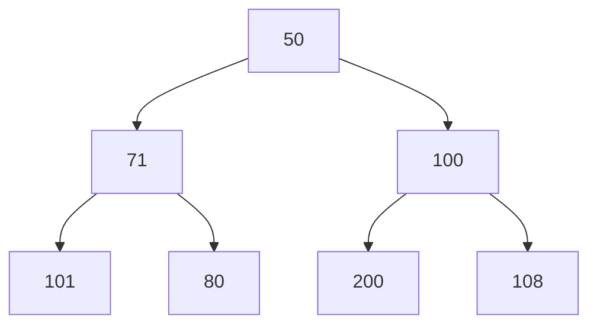

# MinHeap

The data structure where the child node has bigger value than parent node.

```ts
const minHeap = [50, 71, 100, 101, 80, 200, 108]
```


```mermaid
graph TD;
    A[50] --> B[71];
    A --> C[100];
    B --> D[101];
    B --> E[80];
    C --> F[200];
    C --> G[108];
```
