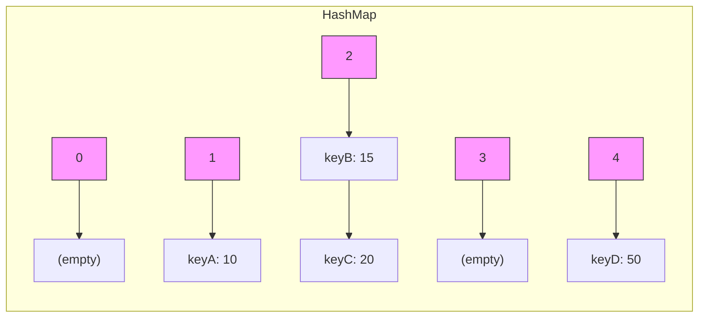
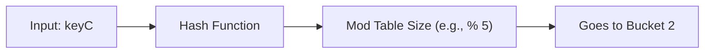

# Map

The solution to a lot of interview questions ended up being hash map 😂.

## 1. Terminology

`load factor`: The amount of data points vs the amount of storage (data.len / storage.capacity).
`key`: a value that is hashable and is used to look up data. The hash has to be consistent.
`value`: a value that is associated with a key.
`collision`: when 2 keys map to the same cell.

## What is map?

It can be represented as array list. Key is mapped to a value.

hash(k) => V

## Examples

Basic Hash Map

Visualising a hash function.

