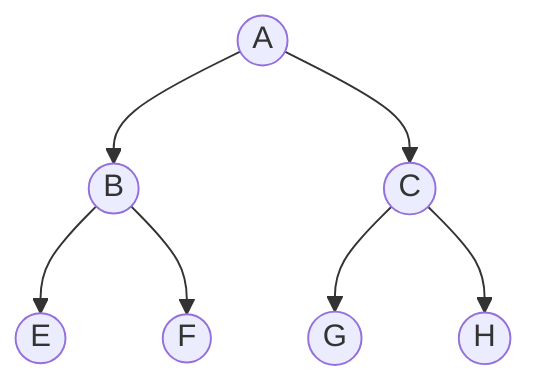

# Trees

Our file systems are trees.

## Going through a binary tree



Visiting all the nodes by recursing to the left

[A, B, C, F, C, G, H] - Starting with the root node.

[E, B, F, A, G, C, H] - Root node is in the middle.

[E, F, B, G, H, C, A] - Finishing with the root node.

## Temp

In progress... creating a binary tree

```ts
type BinaryNode<T> = {
  value: T
  right?: BinaryNode<T>
  left?: BinaryNode<T>
}

export class Tree<T> {
  rootNode?: BinaryNode<T>
  nodeCount: number

  constructor() {
    this.nodeCount = 0
  }

  addNode(value: T) {
    const newNode: BinaryNode<T> = { value }

    if (!this.rootNode) {
      this.rootNode = newNode
      this.nodeCount += 1
      return
    }

    this.insertNode(this.rootNode, newNode)
    this.nodeCount += 1
  }

  private insertNode(current: BinaryNode<T>, newNode: BinaryNode<T>) {
    // This makes it a binary search tree
    if (newNode.value < current.value) {
      if (!current.left) {
        current.left = newNode
      } else {
        this.insertNode(current.left, newNode)
      }
    } else {
      if (!current.right) {
        current.right = newNode
      } else {
        this.insertNode(current.right, newNode)
      }
    }
  }
}
```

```mermaid
graph TD;
    10 -->|left| 5;
    10 -->|right| 15;

    5 -->|left| 2;graph TD;
    10 -->|left| 5;
    10 -->|right| 15;

    5 -->|left| 2;
    5 -->|right| 7;

    2 -->|left| 10;

    15 -->|left| 9;
    15 -->|right| 8;
    5 -->|right| 7;

    2 -->|left| 10;

    15 -->|left| 9;
    15 -->|right| 8;
```

        10
       /  \
      5    15
     / \   /  \
    2   7 9    8

/
10
