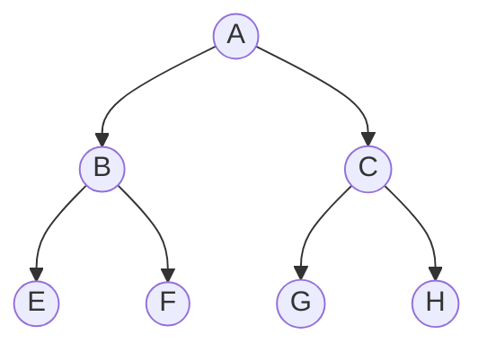

# Trees

Our file systems are trees.

## Going through a binary tree

Visiting node by recursing to the left

[A, B, C, F, C, G, H] - Starting with the root node.

[E, B, F, A, G, C, H] - Root node is in the middle.

[E, F, B, G, H, C, A] - Finishing with the root node.
